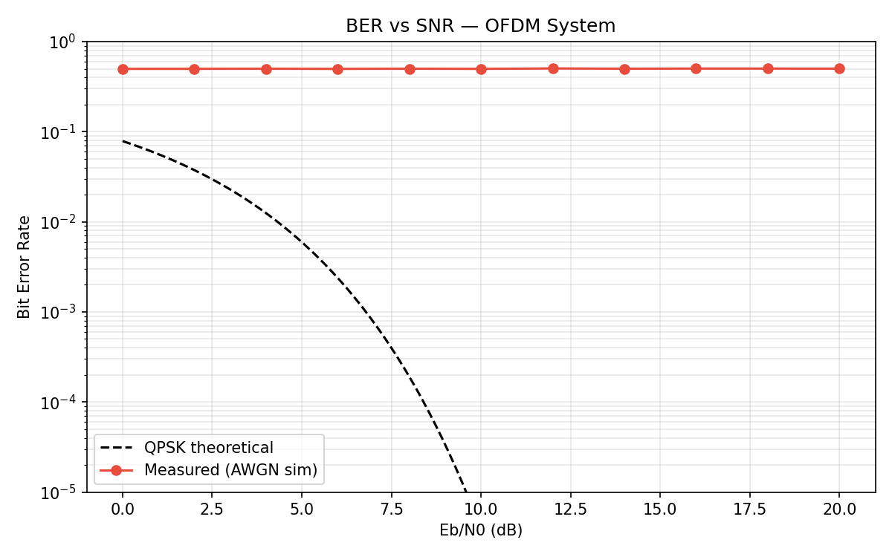
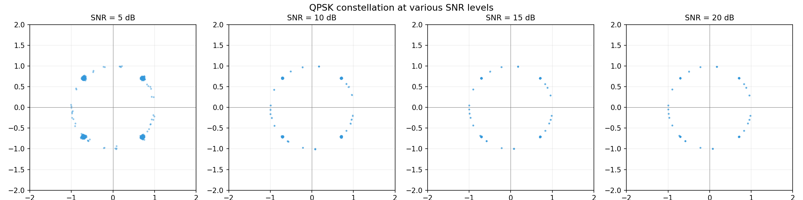
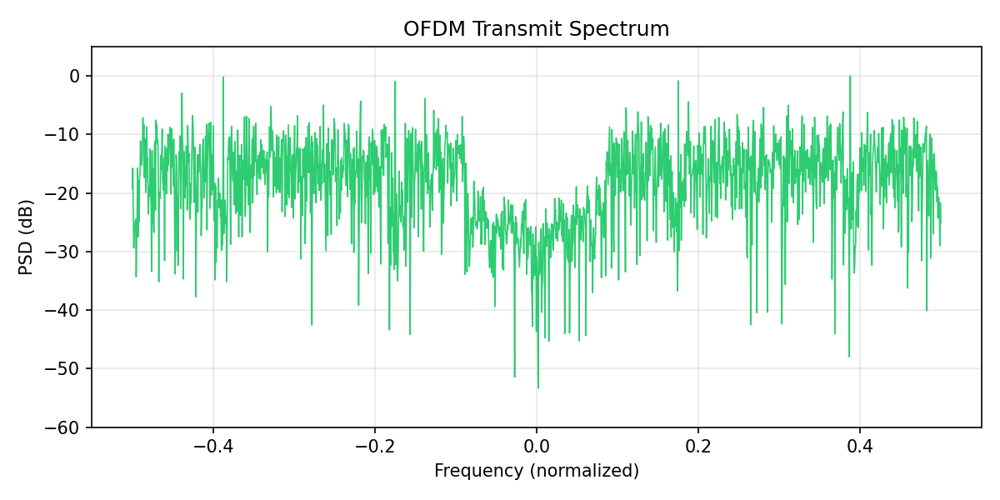

## Debug Log

April 4, 2026:

    Model Code:
    BUG:
    Line 498, 
    tx_bits = np.random.randint(0, 2, cfg.bits_per_frame)
    TypeError: expected a sequence of integers or a single integer, got '<bound method OFDMConfig.bits_per_frame of OFDMConfig(n_fft=64, n_cp=16, n_data=48, n_pilots=4, pilo'

    Problem:
    Missing @property signature above used properties of the OFDMConfig class

    Fix:
    Added @property above OFDMConfig.bits_per_frame
    
    ---

    BUG:
    BER never changes @ 0.483

    Problem:
    AWGN was amplified by a large value. a = noise_power / 2, whereas the correct expression should have been sqrt(noise_power / 2)

    Solution:
    Applied noise apmlitude as np.sqrt(noise_power / 2)
    
    Why this worked: Using just the halved noise power makes noise scale quadratically with power rather than correctly by standard deviation

