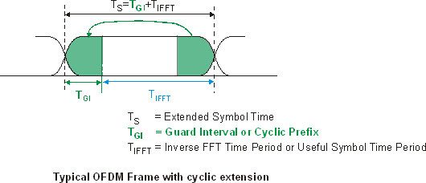

## Week 1

### Modelling the Config Classes
The `pilot_indices` defined property function in the OFMDConfig class returns the pilot sub-carriers in the OFDM Frame.

__My Question__: At which frequency will this pilot frequency be.

__About Pilots__: In the Frequency domain plots (PSD) the pilots are distinct impulses at the pilot subcarrier positions. Pilots carry known symbols (`1 + 0j` by default). They often contain different amplitude or phase charecteristics -- Making them visually distinct from the data subcarriers in a spectogram or constellation plot.

__The Answer__: The pilots are usually at standard defined frequencies. For the `802.11a` (Wi-Fi) the chosen positions are `[-21, -7, 7, 21]`. The reason for taking these specific values is however not very relevant for this project.

___`gaurds`___ :
- The gaurd refers to a fixed delay at the start of a packet transfer that is set to `800 ns`. The total symbol duration is 4.0 $\mu$ out of which 0.8 $\mu$ is just the guard.
- The guard interval is populated with a cyclic prefix, which is a copy of the last `800 ns` of the useful symbol period. This maintains orthogonality.
- The guard interval is designed to protect against typical indoor multipath delay spreads, which generally range between 50ns to 200ns.

- As it can be seen the guards are on both the sides of the FFT. This is because the frequencies must be at both ends and must be symmetric in both the positive as well as the negative planes.

__General__:
---
For the `OFDM` the following values are a standard:
- `bits_per_symbol`$\quad\rightarrow\quad$ 2
- `pilot_indices`$\quad\rightarrow\quad$ [11 $\,$ 25 $\,$ 39 $\,$ 53]
- `guards`$\quad\rightarrow\quad$ [ $0-5$, $\,$ $59-63$ ]
- `bits_per_ofdm_symbol`$\quad\rightarrow\quad$ 96
- `bits_per_frame` $\quad\rightarrow\quad$ 1680

This implementation uses `QPSK` as well as `16-QAM`. While it doesn't use both simultaneously in the same sub-carrier, since that isn't possible - the transmitter estimates whether to use `QPSK/16-QAM` based on the signal strength and power. The receiver is told which modulation was used so that it can use the appropriate demapper.

### QPSK and 16-QAM Normalization Derivation
In this model, constellation points are scaled so the average symbol energy is 1.

QPSK normalization divide by ($\sqrt{2}$)
Unnormalized QPSK points are:[${1+j, 1-j, -1+j, -1-j}$]
Each point has energy:
$|1\pm j|^2 = 1^2 + 1^2 = 2$

So the average symbol energy is:
[$E_s = 2$]

To normalize to unit average energy:
[$s_{\text{norm}} = \frac{s}{\sqrt{E_s}} = \frac{s}{\sqrt{2}}$]

So QPSK uses division by ($\sqrt{2}$).

16-QAM normalization (divide by ($\sqrt{10}$))
For Gray-coded 16-QAM, I and Q each take values:
$[{-3, -1, +1, +3}]$

Average energy per axis:
$E[I^2] = \frac{(-3)^2 + (-1)^2 + (1)^2 + (3)^2}{4} = \frac{9+1+1+9}{4} = 5$

Similarly:
[$E[Q^2] = 5$]

Total average symbol energy:
[$E_s = E[I^2] + E[Q^2] = 5 + 5 = 10$]

To normalize to unit average energy:
[$s_{\text{norm}} = \frac{s}{\sqrt{E_s}} = \frac{s}{\sqrt{10}}$]

So 16-QAM uses division by ($\sqrt{10}$).

### Other Mathematical Concepts used
___`circular-convolution`___: Unlike in linear convolution, the output $Y[k]$ is only dependant on the pointwise multiplication of $X[k]$ and $H[k]$. For, $y = x ⊛ h$
$$
Y[k] = X[k] * H[k]
$$

___`Zadoff-Chu`___: Used for Preamble generation. The preamble lets the receiver know where new frames start. The mathematical formula,
$$
z[n] = e^{-j\pi r\cdot \frac{n(n+1)}{N}}
$$
Here,$\:$ $n\rightarrow$ `bin idx`,$\,$ $r\rightarrow$ `root idx`,$\,$ $N\rightarrow$ `sequence len`

The `Zadoff-Chu` algorithm was used for the following reasons:

    - Constant Amplitude
    - Ideal Autocorrelation
    - Noise resillience through processing gain

